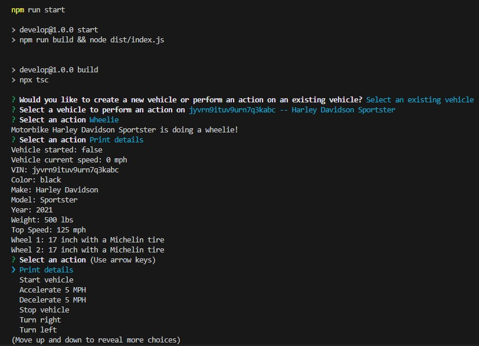

# Vehicle Builder

## Description
The user is able to create a new vehicle or select an existing vehicle and perform certain actions with the selected vehicle. The user is returned to the actions menu after each action until they decide to exit the application. In addition, depending on the currently selected vehicle, there is different actions the user can perform.

## Table of Contents
- [Installation](#installation)
- [Usage](#usage)
- [Contributing](#contributing)
- [Tests](#test)
- [Questions](#questions)

## Installation
In order to install the project, please clone or download the repositiory found at https://github.com/dolaes/Vehicle-Builder. Then please run "npm i" to download the required packages.

## Usage
After completing the installation instructions, run "npm run start" to begin the program. The user will recieve prompts in their terminal in order to create and interact with the different vehicles.

## Contributing
Start code provided by UCI Software Development Boot Camp. Code completed by Daniel Olaes

## Tests
In order to test the project, please test all the different vehicles and their corresponding actions. For example, motorbikes are the only vehicles that can do a wheelie, and trucks are the only vehicles that can tow. These actions should be reflected appropriately in the output.

## Questions
For questions, reach out at:
- GitHub: [dolaes](https://github.com/dolaes)
- Email: [danielolaes18@gmail.com](mailto:danielolaes18@gmail.com)